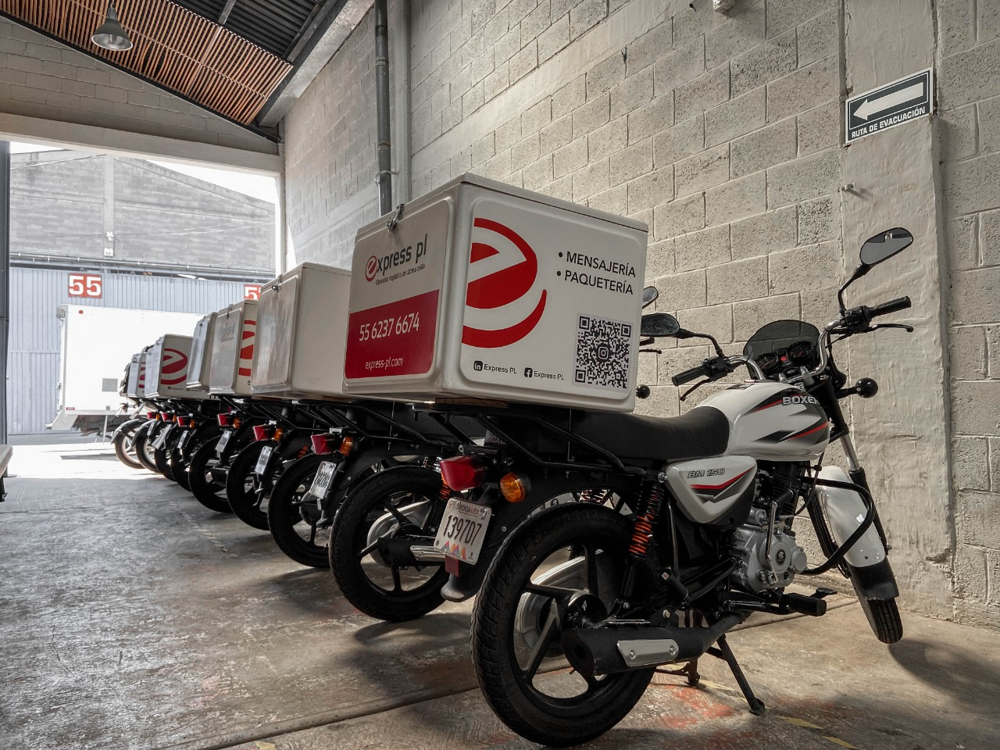

<!DOCTYPE html>
<html lang="en">

<head>
    <meta charset="UTF-8">
    <meta http-equiv="X-UA-Compatible" content="IE=edge">
    <meta name="viewport" content="width=device-width, initial-scale=1.0">
    <title>Express-pl | Envíos de primer milla</title>
    <link rel="stylesheet" href="https://cdn.jsdelivr.net/npm/bootstrap@4.6.2/dist/css/bootstrap.min.css"
        integrity="sha384-xOolHFLEh07PJGoPkLv1IbcEPTNtaed2xpHsD9ESMhqIYd0nLMwNLD69Npy4HI+N" crossorigin="anonymous">
    <link rel="stylesheet" href="assets/styles.css">
</head>

<body>
    <header>
        <nav class="navbar-expand-md navbar-dark bg-dark fixed-top">
            
            <button class="navbar-toggler" type="button" data-toggle="collapse" data-target="#navbarsExampleDefault"
                aria-controls="navbarsExampleDefault" aria-expanded="false" aria-label="Toggle navigation">
                
            </button>
            

            

                <ul class="navbar-nav mr-auto">
                    <li class="nav-item active">
                        <a class="nav-link" href="#">Inicio (current)</a>
                    </li>
                    <li class="nav-item active">
                        <a class="nav-link" href="#">Nosotros (current)</a>
                    </li>
                    <li class="nav-item active">
                        <a class="nav-link" href="#">Nuestras soluciones (current)</a>
                    </li>
                    <li class="nav-item active">
                        <a class="nav-link" href="#">Plataformas (current)</a>
                    </li>
                    <li class="nav-item active">
                        <a class="nav-link" href="#">Rastrea tú paquete (current)</a>
                    </li>
                    

                        <a class="dropdown-item" href="#">Action</a>
                        <a class="dropdown-item" href="#">Another action</a>
                        <a class="dropdown-item" href="#">Something else here</a>
                    

                    </li>
                </ul>

                <form class="form-inline my-1 my-lg-1">
                    <input class="form-control mr-sm-2" type="text" placeholder="Search" aria-label="Search">
                    <button class="btn btn-secondary my-2 my-sm-0" type="submit">Search</button>
                </form>
            

        </nav>
    </header>
    
    

        

            <h1 class="display-5">MENSAJERÍA Y PAQUETERÍA LOCAL, NACIONAL E INTERNACIONAL</h1>
            
 Administramos, gestionamos, controlamos y medimos el flujo de tus envíos.

            
<a class="btn btn-primary btn-lg" href="#" role="button">CONOCE MÁS »</a>

        

    

    

        

            

                <h1 class="text-center">PORTAFOLIO DE SERVICIOS</h1>
            

        

        

            

                

                    
                    

                        <h5 class="card-title">OBJETIVO</h5>
                        
ayudar a nuestros clientes a gestionar, planificar,
                            medir y controlar el flujo diario de sus envíos

                        <a href="#" class="btn btn-primary">Mensajería y Paquetería Local / Nacional</a>
                    

                

            

            

                

                    
                    

                        <h5 class="card-title">MISIÓN</h5>
                        
Generar valores agregados y desarrollo continuo en tecnologías
                            de la información

                        <a href="#" class="btn btn-primary">Servicio LTL Local / Nacional</a>
                    

                

            

            

                

                    
                    

                        <h5 class="card-title">VISIÓN</h5>
                        
Ser un operador logístico de
                            última milla reconocido a nivel nacional

                        <a href="#" class="btn btn-primary">E-fulfillment</a>
                    

                

            

            

                

                    
                    

                        <h5 class="card-title">EMPRESA 100% MEXICANA</h5>
                        
Disfruta de nuestros
                            servicios al interior de la república.

                        <a href="#" class="btn btn-primary">Importación y exportación</a>
                    

                

            

        

    

    
<h1>SOLUCIONES TECNOLÓGICAS</h1>

    

 Nos integramos a través de: Shopify, Woocommerce, modulos ERP,
       Web Services, API´S, Bases de datos 
 

  
    

    <footer class="footer mt-auto py-3">
        

            SOLICITA UNA ASESORÍA
        

        

            <!--Section: Content-->
            <section class="my-md-5" 
              style="background-image: url(Image/image7.jpg); background-size: cover; background-position: center center;">
          
              

          
                <!-- Section heading -->
                <h3 class="text-center font-weight-bold text-white mt-3 mb-5">¡CONTACTANOS!</h3>
          
                <form class="mx-md-5" action="">
          
                  

                    

          
                      

                        

          
                          <!-- Name -->
                          

                            <input type="text" id="name" class="form-control">
                            <label for="name">Nombre</label>
                          

                          <!-- Email -->
                          

                            <input type="text" id="email" class="form-control">
                            <label for="email">Correo electrónico</label>
                          

                          <!-- Message -->
                          

                            <textarea id="message" class="md-textarea form-control" rows="3"></textarea>
                            <label for="message">¿En qué podemos ayudarte?</label>
                          

          
                          <button type="submit" class="btn btn-primary btn-md btn-block ml-0 mb-0">Tú solución en un sólo click (Enviar)</button>
          
                        

                      

          
                    

                    

          
                      <h5 class="font-weight-bold text-white mt-3 mb-5">Ubicación</h5>
                      
Ciudad de México

          
                      <h5 class="font-weight-bold text-white mt-3 mb-5">Teléfono</h5>
                      
 12 345 678 90

          
                      <h5 class="font-weight-bold text-white mt-3 mb-5">Correo electrónico</h5>
                      
contactanos@gmail.com

          
                    

                  

          
                </form>
          
              

          
            </section>
          
          
          

          
    </footer>
</body>

</html>
